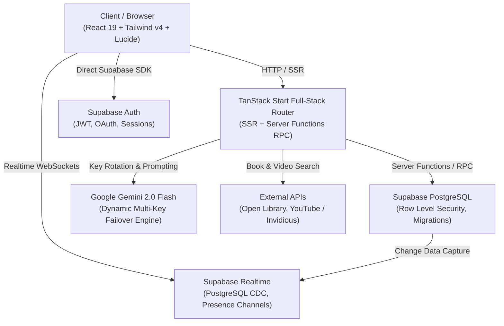

<div align="center">

# 📜 Vellum — Intelligent AI Study & Collaboration Platform

**Transform notes, textbooks, and curiosity into masterable knowledge.**  
Powered by **Google Gemini AI**, **TanStack Start (React 19)**, and **Supabase Realtime**.

[](https://vercel.com)
[](https://react.dev)
[](https://tanstack.com/start)
[](https://supabase.com)
[](https://tailwindcss.com)
[](https://aistudio.google.com)

[Live Demo](https://vellumstudy.vercel.app) • [Features](#-core-features) • [Architecture](#-architecture--tech-stack) • [Quick Start](#-quick-start) • [Database Setup](#-database--supabase-setup) • [Environment Variables](#-environment-variables)

---

</div>

## 🌟 Overview

**Vellum** is an end-to-end, full-stack educational ecosystem engineered to help students learn faster, retain more, and study collaboratively. By pairing state-of-the-art **Google Gemini AI** models with a real-time reactive architecture, Vellum converts raw study material—from dense textbook PDFs to quick bullet notes—into interactive, active-recall study kits in seconds.

Beyond automated study kits, Vellum integrates **private 1-on-1 direct messaging**, **curated YouTube video recommendations**, an **Open Library digital reader** with reading timers, a **parental oversight dashboard**, **healthy study-break brain games**, and an **enterprise-grade admin suite** with dynamic multi-key AI pooling.

---

## ✨ Core Features

### 🧠 1. Multi-Source AI Study Kit Generation
- **Any-Source Ingestion**: Generate structured study suites by pasting raw text, typing any academic topic, or uploading multi-page PDF documents processed via client/server PDF engines.
- **Powered by Google Gemini**: Leverages `gemini-2.0-flash` (and robust fallbacks) via the official `@google/generative-ai` SDK with strict JSON schema validation.
- **Instant Generation**: Creates complete revision suites in a single generation pass:
  - 🗂️ **Active Recall Flashcards**: Interactive 3D flip cards with self-assessment mastery tracking (Need Review vs. Mastered) and keyboard navigation.
  - 📝 **Adaptive Multiple-Choice Quizzes**: Dynamically randomized options, instant feedback, detailed answer explanations, and score tracking.
  - 📖 **Structured Revision Notes**: Organized chapter headings, bullet points, key takeaways, and rich text formatting.
  - 🤖 **"Ask Notebook" AI Assistant**: Context-aware conversational AI grounded specifically in the content of the study kit.

### 📺 2. Smart YouTube Video Lessons & In-App Theater Player
- **Intelligent Video Recommendations**: Toggle video suggestions right from the Study Kit Composer.
- **Topic-Aware Curation**: Automatically extracts keywords and core concepts from your notes and headings to source high-yield video tutorials.
- **In-App Theater Player**: Watch lessons without leaving your study workspace using a distraction-free modal player with direct YouTube links.
- **Custom Topic Search**: Built-in video search bar lets you explore supplementary lessons on any related subject without losing your study progress.

### 💬 3. Real-Time Community & Private Direct Messaging (DMs)
- **Private 1-on-1 DMs**: Seamlessly start private, real-time conversations with fellow students and peers.
- **Modern Chat Interface**: Polished WhatsApp/iMessage-style layout with right-aligned sent bubbles, left-aligned received bubbles, timestamps, and read states.
- **Live Peer Discovery**: View online members with real-time presence indicators and start private direct messages with a single click.
- **Public Study Channels**: Topic-based community lounges (`#general`, `#study-tips`, `#questions`) with threaded chats and study kit sharing.
- **Zero-Config Realtime Sync**: Combines Supabase Postgres Realtime replication with short-poll resilience to ensure instant message delivery.

### 📚 4. Open Library & Digital Reader
- **Integrated Book Search**: Query millions of open-source and public-domain books directly from Open Library and Project Gutenberg.
- **Distraction-Free PDF Reader**: Built-in reader supporting page navigation, zoom controls, and full-screen reading.
- **Reading Session Timers**: Automatically tracks active reading minutes, pages completed, and study streaks saved directly to user analytics.

### 👨‍👩‍👧 5. Parental Oversight & Progress Tracking
- **Secure Student Linking**: Parents connect with their student's account using a unique 6-character Student ID code.
- **Real-Time Study Analytics**: Parents can monitor daily study streaks, total reading hours, completed quizzes, and flashcard mastery metrics.
- **Encouragement System**: Allows parents to stay involved in their child's academic journey with non-intrusive accountability.

### 🎮 6. Brain Booster & Study Break Games
- **Healthy Study Breaks**: Curated library of logic puzzles, brain teasers, and light arcade games designed to refresh cognitive focus.
- **Server-Enforced Daily Limits**: Built-in heartbeat tracking enforces healthy daily limits (e.g., 30 minutes per day) to prevent procrastination.
- **Timezone-Aware Midnight Reset**: Automatically recalculates playtime allowances based on the student's local timezone.

### 🛡️ 7. Admin Control Center & Dynamic Key Pooling
- **Multi-Key Gemini Pool**: Add and manage multiple Google Gemini API keys with priority tiers, automatic quota failover, and encrypted storage in PostgreSQL.
- **Live System Telemetry**: Track platform user registrations, active notebooks generated, token usage, and database health.
- **Role-Based Access Control (RBAC)**: Manage `student`, `parent`, and `admin` roles with custom Row Level Security (RLS) enforcement.
- **Content Moderation**: Review community flags and purge violating posts or messages instantly.

### 🎨 8. World-Class Glassmorphic UI & Internationalization
- **Modern Ambient Glass Aesthetic**: Built with Tailwind CSS v4, dynamic color variables, and fluid blur effects across dark and light modes.
- **Multi-Language Support (i18n)**: Instant switching between languages (English, Amharic, etc.) for inclusive global education.
- **Accessible & Responsive**: Fully responsive layout optimized for mobile smartphones, tablets, and ultra-wide desktop monitors with Radix UI accessible primitives.

---

## 🏗️ Architecture & Tech Stack



| Layer | Technology | Description |
| :--- | :--- | :--- |
| **Framework** | [TanStack Start](https://tanstack.com/start) + [Vite](https://vitejs.dev) | Modern full-stack React framework with type-safe routing, SSR, and RPC server functions |
| **UI Library** | [React 19](https://react.dev) | Latest React release with native hooks, actions, and compiler optimization |
| **Styling** | [Tailwind CSS v4](https://tailwindcss.com) + Lucide Icons | Ultra-fast CSS engine, CSS theme tokens, Radix UI primitives, glassmorphism |
| **State & Data** | [TanStack Query v5](https://tanstack.com/query) | Declarative caching, optimistic mutations, automatic refetching, and window focus sync |
| **AI Integration** | `@google/generative-ai` + Gemini 2.0 Flash | Structured JSON schema study kit generation, smart fallback cascade, and encrypted multi-key rotation |
| **Database & Auth** | [Supabase](https://supabase.com) (PostgreSQL 15+) | Row Level Security (RLS), Realtime channels, Storage buckets, and Auth |
| **Deployment** | [Vercel](https://vercel.com) / Node.js / Docker | Deployed via Nitro preset for serverless SSR performance |

---

## 📁 Repository Structure

```
Vellum/
├── public/                 # Static assets, logos, and favicons
├── src/
│   ├── components/
│   │   ├── games/          # Study break game components & timers
│   │   ├── library/        # Open Library search & detail drawers
│   │   ├── reader/         # PDF and web book reader with session timers
│   │   ├── ui/             # Reusable Radix UI & glassmorphic design system
│   │   ├── AppHeader.tsx   # Global navigation shell, role switch, theme toggle
│   │   └── theme.tsx       # Theme provider and light/dark mode logic
│   ├── hooks/              # Custom React hooks (useAuth, useLocalStorage)
│   ├── integrations/
│   │   └── supabase/       # Supabase client (browser and SSR server client)
│   ├── lib/
│   │   ├── chat.functions.ts      # Server functions for Channels & Private DMs
│   │   ├── gemini.server.ts       # Gemini API key pool, fallback models, AI calls
│   │   ├── study.functions.ts     # Study kit generator, quiz grader, AI assistant
│   │   ├── library.functions.ts   # Open Library query and reading timer logging
│   │   ├── platform.functions.ts  # Admin statistics, key rotation, user management
│   │   └── i18n.tsx               # Localization & translation dictionaries
│   ├── routes/
│   │   ├── __root.tsx             # Root layout with TanStack Query provider & toaster
│   │   ├── index.tsx              # High-converting landing page with feature showcase
│   │   ├── dashboard.tsx          # Study kit composer, recent notebooks, quick metrics
│   │   ├── notebook.$notebookId.tsx # Flashcards, Quizzes, Notes, AI Chat & YouTube Videos
│   │   ├── chat.tsx               # Realtime Public Channels & 1-on-1 Private DMs
│   │   ├── library.tsx            # Digital library search and curated classics
│   │   ├── read.$bookId.tsx       # In-app book reader
│   │   ├── parent.tsx             # Parental oversight and student progress tracking
│   │   ├── games.tsx              # Brain break games with time limits
│   │   ├── admin.tsx              # Multi-key AI pool, user management, metrics
│   │   ├── login.tsx & signup.tsx # Authentication flows with role selection
│   │   └── settings.tsx           # Profile customization, student ID, avatar picker
├── supabase/
│   ├── setup.sql           # Complete, idempotent database schema & RLS policies
│   └── migrations/         # Incremental database migration scripts
├── .env.example            # Template for local environment variables
├── package.json            # Project dependencies and npm scripts
├── tsconfig.json           # Strict TypeScript configuration
└── vite.config.ts          # Vite and TanStack Router compiler configuration
```

---

## 🚀 Quick Start

### 1. Prerequisites
- **Node.js**: `v18.18.0` or later (`v20+` recommended)
- **Package Manager**: `npm`, `pnpm`, or `yarn`
- **Supabase Account**: A free project at [supabase.com](https://supabase.com)
- **Google AI Studio Key**: A free Gemini API key from [aistudio.google.com](https://aistudio.google.com)

### 2. Clone the Repository
```bash
git clone https://github.com/eseromdemissew/Vellum-Study.git
cd Vellum-Study
```

### 3. Install Dependencies
```bash
npm install
```

### 4. Configure Environment Variables
Create a local `.env` file from the provided template:
```bash
cp .env.example .env
```
Open `.env` and fill in your Supabase project keys and Google Gemini credentials. (See [Environment Variables](#-environment-variables) for details).

### 5. Initialize the Database
1. Open your project on the [Supabase Dashboard](https://supabase.com/dashboard).
2. Navigate to the **SQL Editor**.
3. Copy the entire contents of [`supabase/setup.sql`](supabase/setup.sql) into the editor.
4. Click **Run**. This will create all required tables, Row Level Security (RLS) policies, triggers, and Realtime publications.

### 6. Run the Development Server
```bash
npm run dev
```
Open your browser at [http://localhost:5173](http://localhost:5173).

---

## 🗄️ Database & Supabase Setup

The entire schema is automated and idempotent in [`supabase/setup.sql`](supabase/setup.sql). Here is a summary of the core database tables:

| Table | Description |
| :--- | :--- |
| `profiles` | User profiles with `display_name`, `avatar_url`, `student_id`, and `role` (`student`, `parent`, `admin`) |
| `notebooks` | Master record for AI study kits created by users |
| `flashcards` | Active recall cards with front/back text and user mastery score |
| `quizzes` & `quiz_questions` | Adaptive multiple choice quizzes with randomized options and rationale |
| `notes` | Formatted study guides and chapter summaries |
| `chat_channels` & `chat_messages` | Public discussion lounges with Realtime broadcast enabled |
| `dm_conversations` & `dm_messages` | Private 1-on-1 direct messaging between students |
| `reading_sessions` | Tracks duration, book ID, and pages read for digital library analytics |
| `parent_student_links` | Links parent accounts to students via 6-character Student ID |
| `ai_api_keys` | Encrypted multi-key pool for Google Gemini with usage counters and failover priority |
| `daily_game_time` | Tracks daily educational game playtime with automated timezone resets |

### Making an Account Admin
To elevate your user account to an Administrator:
```sql
INSERT INTO public.user_roles (user_id, role)
SELECT id, 'admin' FROM auth.users WHERE email = 'your-email@example.com'
ON CONFLICT (user_id, role) DO NOTHING;
```

---

## 🔑 Environment Variables

| Variable | Scope | Description | Required? |
| :--- | :--- | :--- | :--- |
| `VITE_SUPABASE_URL` | Client | Supabase Project URL (`https://xyz.supabase.co`) | **Yes** |
| `VITE_SUPABASE_PUBLISHABLE_KEY` | Client | Supabase Anonymous / Publishable Key | **Yes** |
| `SUPABASE_URL` | Server | Supabase Project URL for server-side RPC functions | **Yes** |
| `SUPABASE_SERVICE_ROLE_KEY` | Server | Supabase Service Role Key (Used for admin tasks & key encryption) | **Yes** |
| `GEMINI_API_KEY` | Server | Primary Google Gemini API Key (Can also be managed via Admin UI) | Optional |
| `GEMINI_MODEL` | Server | Model version (default: `gemini-2.0-flash` or `gemini-flash-latest`) | Optional |
| `VITE_SITE_URL` | Client | Canonical deployment URL (e.g., `https://vellumstudy.vercel.app`) | Optional |
| `VITE_GA_MEASUREMENT_ID` | Client | Optional Google Analytics 4 Measurement ID | Optional |

---

## 🛠️ Available Scripts

| Command | Action |
| :--- | :--- |
| `npm run dev` | Starts the Vite local development server with HMR |
| `npm run build` | Compiles and builds the production bundle |
| `npm run build:vercel` | Builds the application tailored for Vercel serverless deployment |
| `npm run preview` | Previews the production build locally |
| `npm run lint` | Runs ESLint across the codebase |
| `npm run format` | Runs Prettier to enforce consistent code styling |

---

## 🚢 Deployment to Vercel

Vellum is optimized for one-click deployment to **Vercel** with full SSR server function support:

1. Push your repository to GitHub.
2. Import the project into your [Vercel Dashboard](https://vercel.com/new).
3. Set the Framework Preset to **Vite** or **Other**.
4. Configure the Environment Variables listed in the table above.
5. Deploy! Vellum's `vercel.json` and Nitro build configuration will handle serverless SSR and client asset routing automatically.

---

## 🔒 Security & Privacy

- **Row Level Security (RLS)**: Every single table in PostgreSQL has RLS strictly enabled. Students can only view their own study kits and private direct messages.
- **Encrypted API Keys**: Dynamic Gemini keys added via the Admin portal are stored encrypted in the database using the server secret.
- **Zero AI Training on User Data**: User notes and generated content are transmitted directly to the Google Gemini inference endpoint and are not used for public model training.

---

## 🤝 Contributing

Contributions, issues, and feature requests are welcome!  
Feel free to check out the [issues page](https://github.com/eseromdemissew/Vellum-Study/issues) if you want to contribute.

1. Fork the Project
2. Create your Feature Branch (`git checkout -b feature/AmazingFeature`)
3. Commit your Changes (`git commit -m 'feat: add some AmazingFeature'`)
4. Push to the Branch (`git push origin feature/AmazingFeature`)
5. Open a Pull Request

---

## 📄 License

Distributed under the MIT License. See `LICENSE` for more information.

<div align="center">

Crafted with 💜 for students and educators worldwide.

</div>
